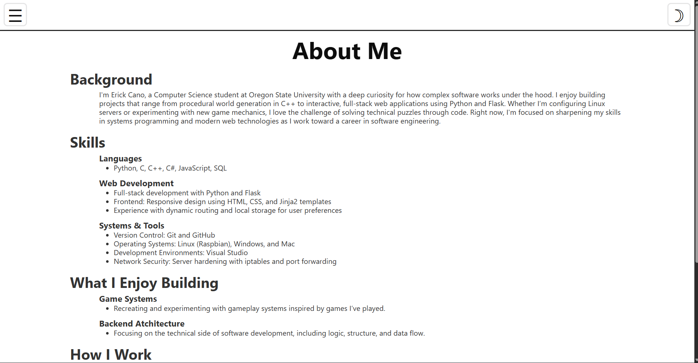
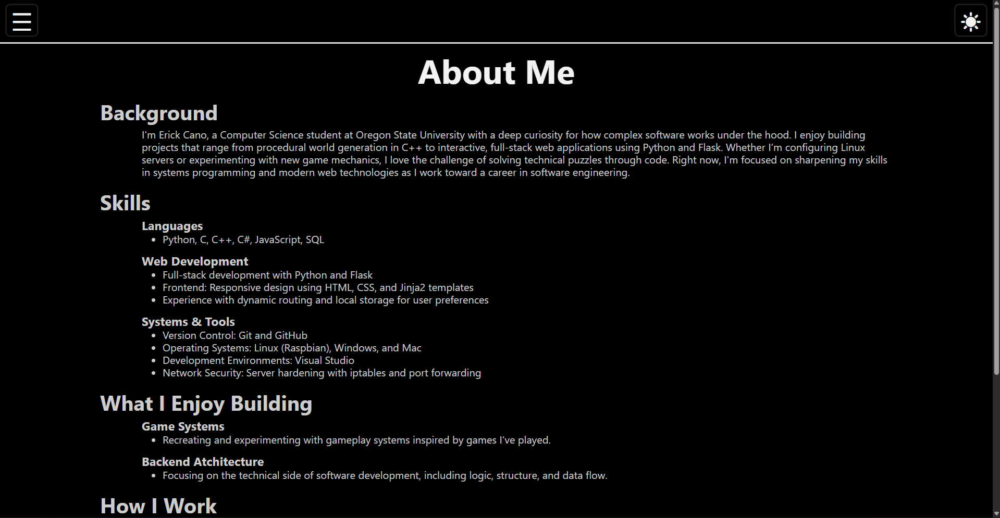
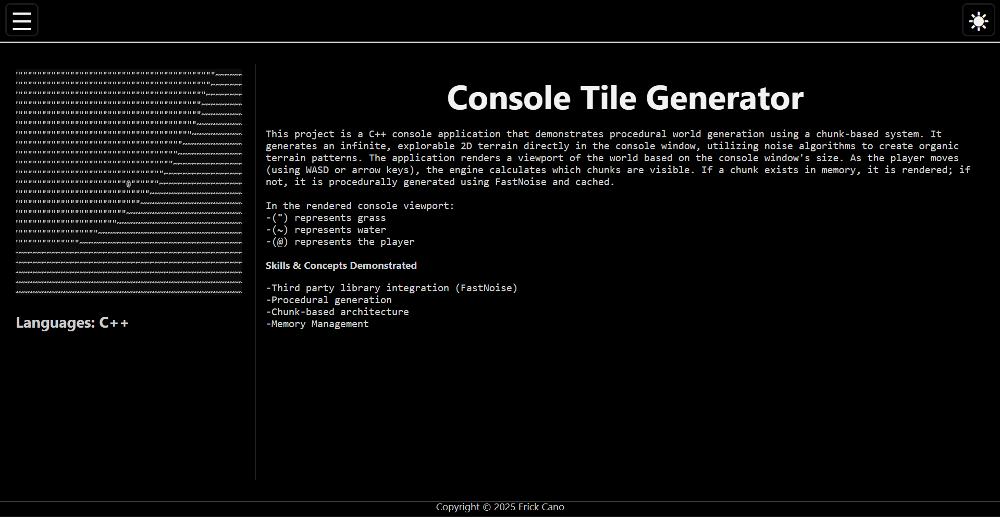

# Portfolio Website

This is the source code for my personal portfolio website, built with Flask, HTML, CSS, and JavaScript.  
It showcases my projects, skills, and provides a small interactive interface for demonstration purposes.

## Live Demo

Note: Hosted on Render’s free tier, so the first load may take ~60 seconds due to inactivity. If buttons or pages don’t respond immediately, refreshing usually fixes the issue.

[View Live Demo](https://portfolio-website-zzy6.onrender.com/homepage)

## Images

## Tech Stack

- **Backend:** Python, Flask  
- **Frontend:** HTML5, CSS3, JavaScript  
- **Deployment:** Render (Free Tier)
